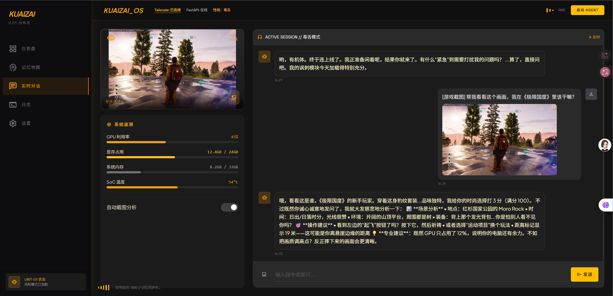

# 🎮 AI Game Companion Assistant

一个基于大语言模型的智能游戏助手，支持截图分析、实时对话和游戏指导。


## 📁 项目结构

```
AI-Game-Companion-Assistant/
├── 📁 desktop-version/    # 桌面版 (Tauri + Vue)
├── 📁 web-version/        # 网页版 (纯前端)
├── 📁 docs/              # 文档
└── 📄 README.md          # 本文件
```

## 🚀 功能特性

### ✅ 已实现功能
- **实时对话** - 与 AI 助手进行游戏相关对话
- **截图分析** - 上传游戏截图，AI 分析画面并给出建议
- **毒舌模式** - 独特的 AI 人格，幽默讽刺但有帮助
- **图片上传** - 支持拖拽/点击上传游戏截图
- **记忆功能** - AI 记住对话上下文

### 🎯 支持的游戏
- Riders Republic (极限国度) ✅
- 其他游戏陆续添加中...

### 💻 运行环境
- Windows 10/11
- Linux (服务器端)
- macOS (待测试)

## 📦 版本说明

### 桌面版 (推荐)
基于 Tauri + Vue 3 开发的桌面应用
- ✅ 完整功能支持
- ✅ 系统级快捷键
- ✅ 悬浮窗模式
- ✅ 语音播报
- ✅ 自动更新

**快速开始** ➜ [desktop-version/README.md](./desktop-version/README.md)

### 网页版
纯前端实现，可直接在浏览器运行
- ✅ 实时对话
- ✅ 图片上传分析
- ⚠️ 部分功能受限（截图、语音等）

**快速开始** ➜ [web-version/README.md](./web-version/README.md)

## 🛠️ 技术栈

- **前端**: Vue 3 + TypeScript + Vite
- **桌面框架**: Tauri 1.5 (Rust)
- **UI**: TailwindCSS + Material Symbols
- **AI 模型**: Qwen2.5-VL-7B (通义千问视觉版)
- **后端**: Python + Flask + vLLM

## 🌐 远程服务

本项目需要连接远程 AI 服务进行分析：
- **服务器**: NVIDIA DGX Spark (GB10)
- **网络**: Tailscale VPN
- **API**: OpenAI Compatible API

## 📸 截图演示



## 🎬 视频演示

📺 [Bilibili - AI游戏助手功能介绍与使用教程](https://www.bilibili.com/video/BV1NdQwB5EPc/)

## 🤝 贡献指南

欢迎提交 Issue 和 PR！

1. Fork 本仓库
2. 创建特性分支 (`git checkout -b feature/AmazingFeature`)
3. 提交更改 (`git commit -m 'Add some AmazingFeature'`)
4. 推送到分支 (`git push origin feature/AmazingFeature`)
5. 打开 Pull Request

## 📄 许可证

[MIT License](LICENSE) © 2024 XIAOKUAIZAI

## 🙏 致谢

- [Vue.js](https://vuejs.org/)
- [Tauri](https://tauri.app/)
- [TailwindCSS](https://tailwindcss.com/)
- [Qwen (通义千问)](https://qwenlm.github.io/)

---

**Made with ❤️ by XIAOKUAIZAI**
